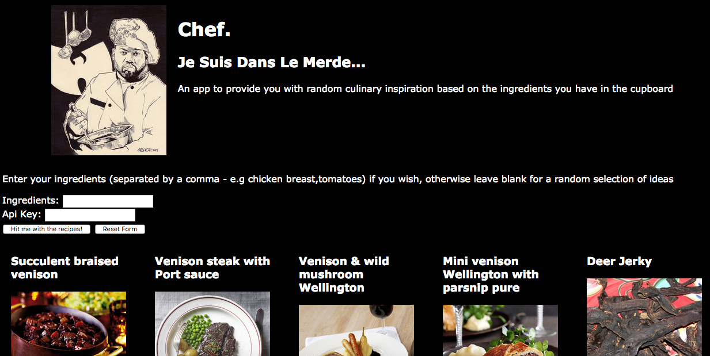

# Codeclan Week 07 Day 05
## Introduction to PubSub, Apis and Promises
### Weekend Homework

#### Brief

Create a modular single page web application based on an API of your choosing.

# Chef
A single page web app utilising JS, Webpack and the food2fork API which provides you with recipes based on the ingredients you have in your cupboard.

Note that API key has to be provided from food2fork for this to function. This has *not* been hardcoded into the app.

Screenshot:

#### Order of Operations

* Get the paper out

* Check the format of the api object being received

* Map the parsed return to an object suitable for your requirements

* Map out the communication between models and views and the types being passed

* To reiterate, plan, draw your diagram, then you'll know which views are sending and receiving data - and who's doing the processing.

* One you know how your data is moving you can decide what you want to do with it - calculate, process, modify DOM.

#### Notes

* Check CORS! Even if it works in the browser it doesn't necessarily work in the app request

* You're waiting at both ends! Waiting on a promise of receiving a data in the request helper, and waiting on a promise of the data being returned to the model

* Review notes on Promise/fetch.

* Always check the parameters being passed via the console

* CSS is still weak, could do with taking that on in the project if possible

* Remember to focus on your markdowns for readability, you've fallen off a bit this week.

#### Files

* Pub Sub.js - Helper for dealing with PubSub bus
* Request helper.js - Helper for fetching JSON Api
* Recipe.js -  Model providing logic for processing API and passing to views
* Recipe Form View.js - Initial form view for passing data to model
* Result View.js - Renders Recipe views for each recipes
* Recipe View.js - Reders view for each returned recipe
* App.js - Main app runner
* Index.html - App landing page
* furious_styles.css - stylesheet for project
* /images - images used in project
